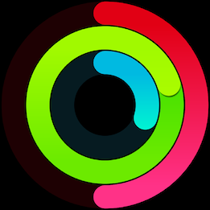

# activityrings

This project provides a simple way to render activity rings images similar to the ones found in the Apple Watch activity app. 

## Example

After compiling the activity command, generate a sample image by running the following command:
`./activity --out-path=sample-rings.png --move 0.5 --stand 0.3 --exercise 1.2`

The above command will draw a new PNG and save it to sample-rings.png. The `out-path` parameter is used to control where the file is written and defaults to rings.png. The command above will generate an image like this:

### HTTP Server

A basic HTTP server is also provided to serve up these activity images. Run the server by compiling the activity binary and running the following command:
`activity --http`

Then visit a URL like this to view the image in a browser: 
`http://localhost:8082/rings?stand=0.2&exercise=0.5&move=1.3`

## Swatches

The provided swatches command is a utility program to show the color gradients that will be used for the different rings values. 

## Special Thanks

While writing this the [MKRingProgressView](https://github.com/maxkonovalov/MKRingProgressView) project was incredibly helpful. Especially in figuring out how to draw the gradients for the rings.

## TODOs
 
There are a few TODOs sprinkled throughout the code where I remembered to leave a note for something that needed to be done or improved. A few things that stand out:
* Making the image sizes more variable, now they use a fixed size and ring specs
* Drawing zero values isn't really working
* The shadows under the ends of the overlapping rings aren't very good and should be improved